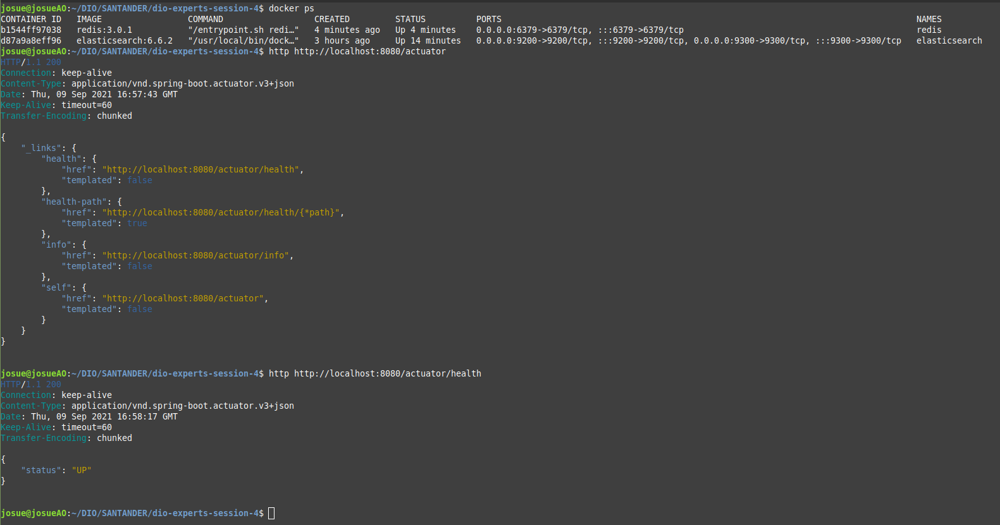

## Projeto de arquitetura de software baseada em microsserviços
     

### Representação do modelo:

<p align="center"></p>

### Alguns passos básico sobre o comado ```http``` no terminal:

<p align="center"></p>

### Esses passos são recomendados antes de testar o projeto:

```docker run -d --name elasticsearch -p 9200:9200 -p 9300:9300 -e "discovery.type=single-node" elasticsearch:6.6.2```

### Na pasta, ```Util``` existe um arquivo ```docker-compose.yml``` para também facilitar o ```Redis```: